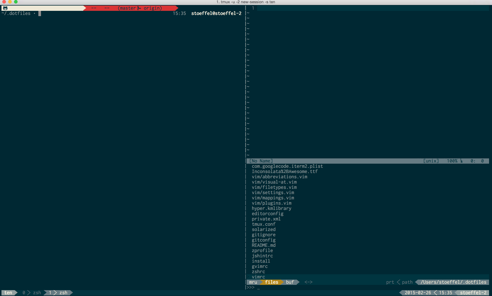

.dotfiles
=========



## System requirements:

* OS X 10.10+
* Xcode 6.0.1+
* Command Line Tools for Xcode

## installation

```sh
git clone https://github.com/stoeffel/.dotfiles ~/.dotfiles
cd .dotfiles
./install
```

# included

* brew
* node
    * nvm
    * serve
    * yeoman
    * dark-mode
* hub
* tmux
* neovim
    * vim-settings
    * Vundle
* zsh
    * oh-my-zsh
    * oh-my-git
* wget
* curl
* tmux
* hub

# downloads

* iterm2
* Karabiner
* KeepingYouAwake
